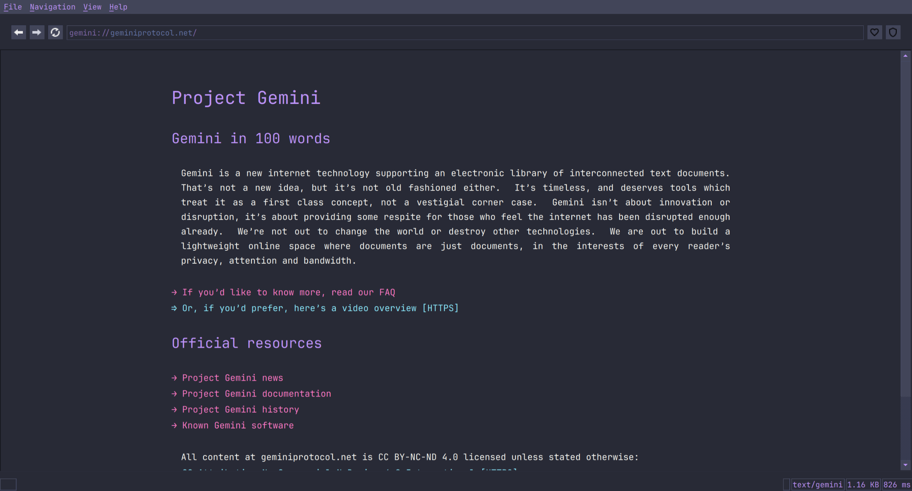

# Dracula for [Kristall](https://kristall.random-projects.net/)

> A dark theme for [Kristall](https://kristall.random-projects.net/).

## Install

All instructions can be found at [draculatheme.com/kristall](https://draculatheme.com/kristall).

## Team

This theme is maintained by the following person and a bunch of [awesome contributors](https://github.com/dracula/kristall/graphs/contributors).

|  |
| --------------------------------------------------------------------------------------------- |
| [hellfire103](https://github.com/hellfire103)                                                 |

## Community

- [Twitter](https://twitter.com/draculatheme) - Best for getting updates about themes and new stuff.
- [GitHub](https://github.com/dracula/dracula-theme/discussions) - Best for asking questions and discussing issues.
- [Discord](https://draculatheme.com/discord-invite) - Best for hanging out with the community.
- [Reddit](https://www.reddit.com/r/draculatheme)

## License

[MIT License](./LICENSE)
